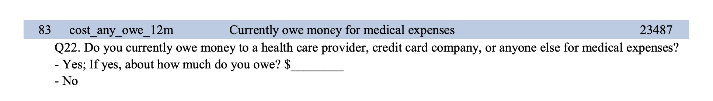

```{r setup, include=FALSE}
knitr::opts_chunk$set(echo = TRUE)
```

# Does receiving Medicaid reduce medical debt?

In 2008, in response to the ACA's mandate that states expand Medicaid eligibility, Oregon used a lottery to randomly assign people to receive Medicaid ([see here](https://www.nber.org/programs-projects/projects-and-centers/oregon-health-insurance-experiment) for more details). Researchers tracked (and continue to track) a whole host of health and financial outcomes as a result of receiving access to Medicaid. 

You're going to investigate the effect of Medicaid on one outcome:



## Load data

```{r libraries-data, warning=FALSE, message=FALSE}
library(tidyverse)
library(broom)

# TODO: Use read_csv() to load data/oregon.csv
df_raw <- read_csv("data/oregon.csv")
```


## Clean data

There are two categorical columns in this dataset. It will make it easier to calculate differences in proportions if we have numeric versions of the columns too. Use `mutate()` and `case_when()` (look at the dplyr cheatsheet) to add two new columns:

- `treatment_num`: 0 if not treated, 1 if treated
- `outcome_num`: 0 if the person doesn't owe money, 1 if the person does owe money

```{r}
# TODO: Add two new columns with numeric versions of treatment and outcome
df <- df_raw %>% 
  mutate(treatment_num = if_else(treatment == "Treated", 1, 0),
         outcome_num = if_else(owe_medical_12 == "Owe Money", 1, 0))

summary(df)
```


## Find the difference in outcome caused by treatment

```{r}
# TODO: Use group_by() and summarize() (or just count()) to calculate the number
# of people in the treatment and control groups who do and don't have medical
# debt. Is there a difference?
df %>% 
  group_by(treatment_num) %>% 
  count(outcome_num) %>% 
  mutate(propn = n/sum(n))
```

```{r}
# TODO: Use lm() to calculate the exact difference in the proportion of people
# with medical debt across the treatment and control groups. Is the difference
# significant?
model_naive <- lm(outcome_num ~ treatment_num, data = df)
summary(model_naive)
```

```{r}
# TODO: For bonus fun, try to visualize the difference in proportions
ggplot(df, aes(x = outcome_num, fill = factor(treatment_num))) +
  geom_density(alpha = 0.5)
```

```{r}
# TODO: For extra super bonus fun, run a Bayesian outcome model with the brms
# package so that you can talk about credible intervals
library(brms)
library(tidybayes)

model_bayes <- brm(
  bf(outcome_num ~ treatment_num),
  data = df,
  cores = 4,
)
```

```{r}
get_variables(model_bayes)

model_draws <- model_bayes %>% 
  gather_draws(c(b_treatment_num)) 

ggplot(model_draws, aes(x = .value, y = .variable)) +
  stat_halfeye()

model_draws %>% 
  filter(.variable == "b_treat_pay") %>% 
  summarize(prop_gt_0 = sum(.value > 0) / n())
```

